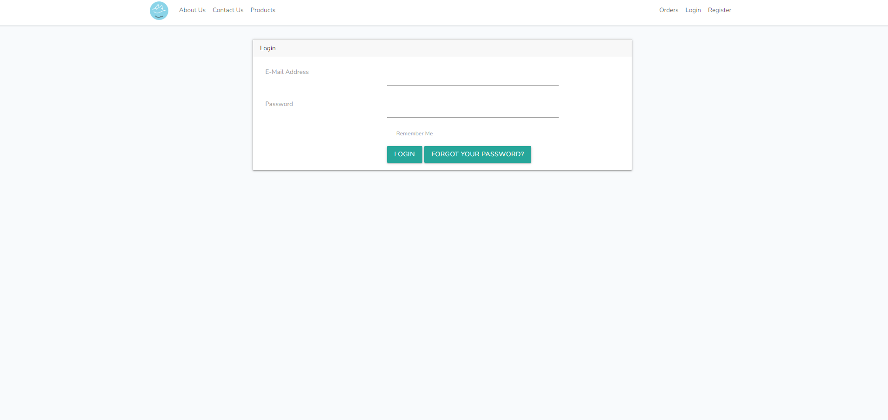
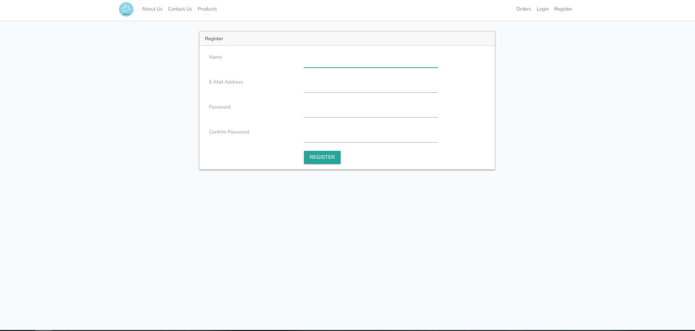
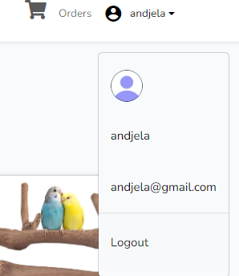
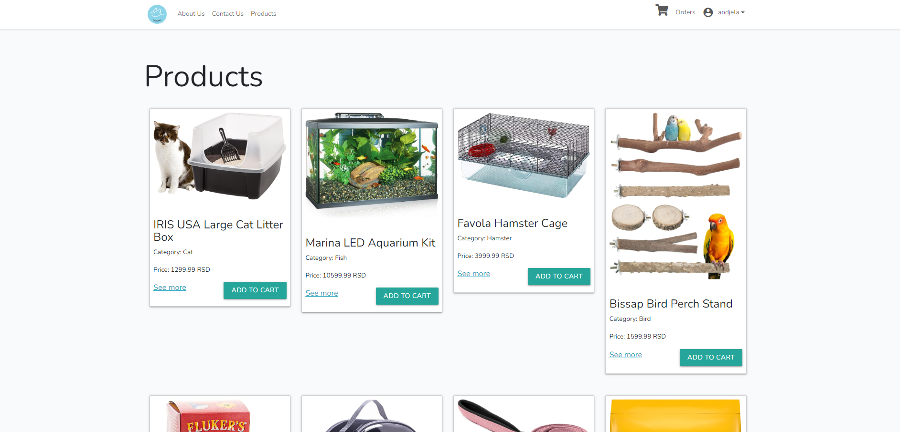
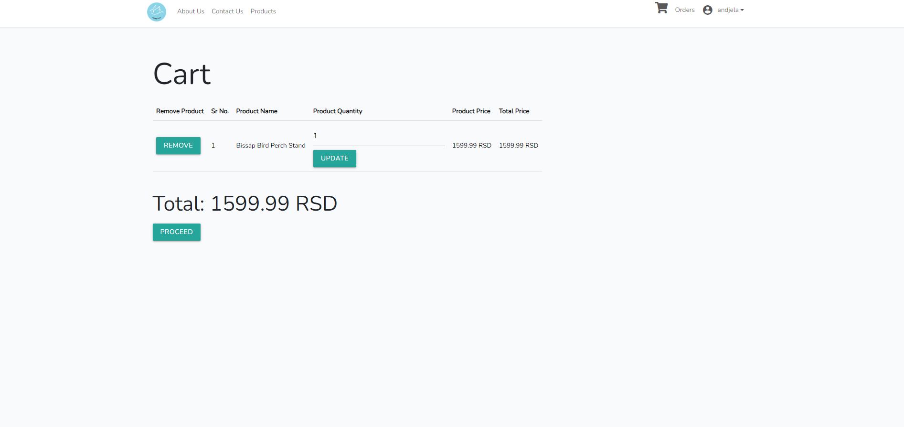
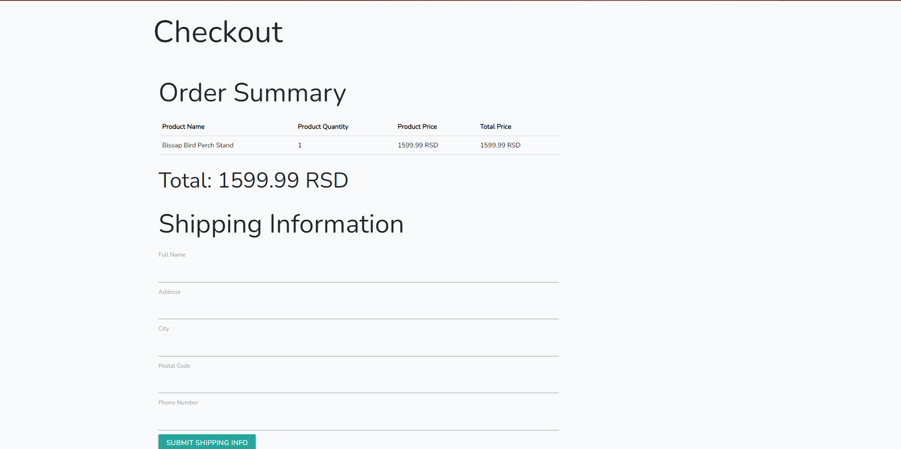

# petShop projekat

Potrebno je napraviti bazu podataka pod imenom 'petshopdb' i izmeniti informacije u .env. Nekada je potrebno pokrenuti *php artisan key:generate* kako bi se genersio APP KEY.

*php artisan migrate* kako bi se napravile tabele.

*php artisan db:seed* kako bi se popunile tabele sa podacima.

*php artisan storage:link* kako bi se napravio link sa postojećim storage-om.

*php artisan serve* kako bi se pokrenuo server.

# Admin login informacije
Email:andjela@gmail.com

Password:12345678

# Običan korisnik login informacije
Email:test@gmail.com

Password:87654321

# Slike sajta

